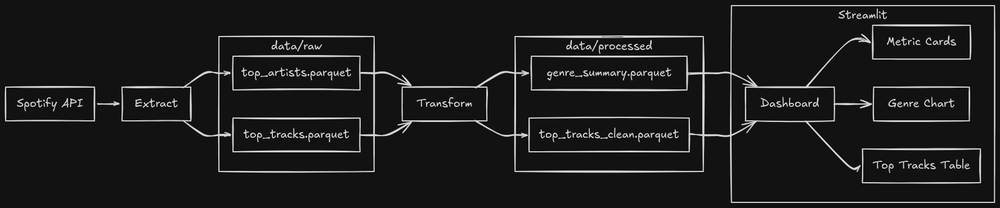

# Spotify Wrapped ETL

A personal music analytics pipeline that extracts listening data from Spotify API and visualizes it as a Spotify Wrapped-style dashboard.

## Architecture



## Tech Stack

| Library           | Description             |
| ----------------- | ----------------------- |
| Spotipy           | Spotify Web API wrapper |
| FastAPI + Uvicorn | OAuth callback server   |
| Pandas            | data transformation     |
| Parquet           | local data storage      |
| Streamlit         | dashboard               |
| ECharts           | interactive charts      |

## Setup

**1. Clone the repository**

```bash
git clone https://github.com/braiyenmassora/spotify-wrapped-etl.git
cd spotify-wrapped-etl
```

**2. Create a Spotify Developer App**

Go to <https://developer.spotify.com/dashboard>, create a new app, and add `http://127.0.0.1:8889/callback` as redirect URI.

**3. Configure `.env`**

```
SPOTIPY_CLIENT_ID=your_client_id
SPOTIPY_CLIENT_SECRET=your_client_secret
SPOTIPY_REDIRECT_URI=http://127.0.0.1:8889/callback
TIME_RANGE=medium_term
LIMIT=50
DATA_FORMAT=parquet
RAW_DATA_PATH=data/raw
PROCESSED_DATA_PATH=data/processed
```

**4. Install dependencies**

```bash
make setup
```

## Usage

```bash
make pipeline      # run full ETL
make dashboard     # start dashboard
make remove-token  # remove spotify token cache
make clean         # remove all data files
```

## Dashboard

Once the pipeline has run, start the dashboard with `make dashboard`. It displays a summary of listening habits over the last 6 months based on data pulled from the Spotify API.

| Section          | Description                                                   |
| ---------------- | ------------------------------------------------------------- |
| Top Genre        | most frequent genre across top 50 artists                     |
| Top Artist       | most listened artist                                          |
| Top Track        | highest popularity track                                      |
| Genre Chart      | top 10 genres visualized as a bar chart                       |
| Top Tracks Table | full list of top 50 tracks ranked by popularity score (0-100) |

## License

MIT License — free to use, modify, and distribute.
